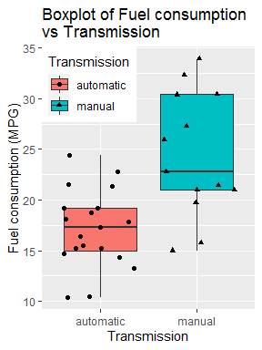
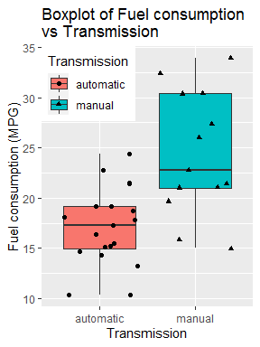
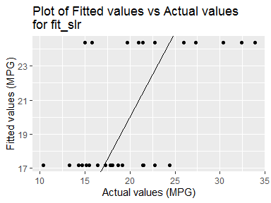
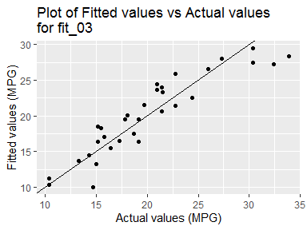
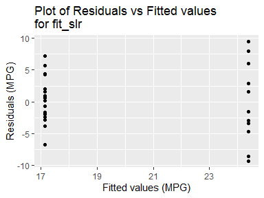
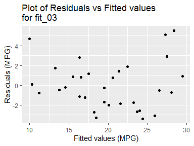

## Executive Summary

In this project we explore the **`mtcars`** data in the **`datasets`** package and establish the relationship between a set of variables and the fuel consumption in *Miles per Gallon* (**MPG**) as *outcome*. In particuar, we try to answer the following two questions:

1. *Is an automatic or manual transmission better for MPG?*
2. *Can we quantify the MPG difference between automatic and manual transmissions.* 

For answering the above questions, we fit a *linear regression curve* between the outcome **`mpg`** and the predictor **`am`**. We also consider the effect of other variables by using *multivariable regression analysis*. Then, we perform *model selection* to pick the most appropriate model that captures the above relationship.

The results indicate that the **Manual Transmission** is better for the **MPG** as compared to **Automatic Transmission** by about **2.08 MPG** (keeping the other variables constant). But, the results are **NOT** significant to ascertain that.


## Exploratory Data Analysis


The data was extracted from the 1974 *Motor Trend* US magazine, and comprises fuel consumption and 10 aspects of automobile design and performance for 32 automobiles (1973–74 models).

The variables are:

1. **mpg** - Miles/(US) gallon
2. **cyl** - Number of cylinders
3. **disp** - Displacement (cu.in.)
4. **hp** - Gross horsepower
5. **drat** - Rear axle ratio
6. **wt** - Weight (1000 lbs)
7. **qsec** - 1/4 mile time
8. **vs** - Engine (0 = V-shaped, 1 = straight)
9. **am** - Transmission (0 = automatic, 1 = manual)
10. **gear** - Number of forward gears
11. **carb** - Number of carburetors

Let us look at the structure of the dataset after some preprocessing.


```
## 'data.frame':	32 obs. of  11 variables:
##  $ mpg : num  21 21 22.8 21.4 18.7 18.1 14.3 24.4 22.8 19.2 ...
##  $ cyl : Ord.factor w/ 3 levels "4"<"6"<"8": 2 2 1 2 3 2 3 1 1 2 ...
##  $ disp: num  160 160 108 258 360 ...
##  $ hp  : num  110 110 93 110 175 105 245 62 95 123 ...
##  $ drat: num  3.9 3.9 3.85 3.08 3.15 2.76 3.21 3.69 3.92 3.92 ...
##  $ wt  : num  2.62 2.88 2.32 3.21 3.44 ...
##  $ qsec: num  16.5 17 18.6 19.4 17 ...
##  $ vs  : Factor w/ 2 levels "V","S": 1 1 2 2 1 2 1 2 2 2 ...
##  $ am  : Factor w/ 2 levels "automatic","manual": 2 2 2 1 1 1 1 1 1 1 ...
##  $ gear: Ord.factor w/ 3 levels "3"<"4"<"5": 2 2 2 1 1 1 1 2 2 2 ...
##  $ carb: Ord.factor w/ 6 levels "1"<"2"<"3"<"4"<..: 4 4 1 1 2 1 4 2 2 4 ...
```

Considering the variables of interest, i.e. the **`mpg`** and **`am`**, we plot a boxplot to study the distribution of the data.

<!-- -->

From the above plot, the *manual* transmission appears to be better with respect to fuel consumption. Let us continue with *multivariable regression analysis*.


## Multivariable Regression Analysis

Initially, set the **seed** for reproducibiliity.


Let us first fit a *simple linear regression model* considering only **`mpg`** and **`am`** variables.


```
##              Estimate Std. Error   t value     Pr(>|t|)
## (Intercept) 17.147368   1.124603 15.247492 1.133983e-15
## ammanual     7.244939   1.764422  4.106127 2.850207e-04
```

Though, this model gives similar results as that from the *exploratory data analysis*, we are unable to confidently say that the model captures the complete relationship since there may be other variables which explain the variability in the data.

Therefore, we proceed with **Nested** *multivariable regression models*. The models are nested with the consideration of the *correlation* between the different variables and the variable **`am`** and also some common knowledge inferences about the motor vehicle performance.


We will perform *ANOVA* analysis for model selection.


```
## Analysis of Variance Table
## 
## Model  1: mpg ~ am
## Model  2: mpg ~ am + wt
## Model  3: mpg ~ am + wt + hp
## Model  4: mpg ~ am + wt + hp + qsec
## Model  5: mpg ~ am + wt + hp + qsec + disp
## Model  6: mpg ~ am + wt + hp + qsec + disp + cyl
## Model  7: mpg ~ am + wt + hp + qsec + disp + cyl + vs
## Model  8: mpg ~ am + wt + hp + qsec + disp + cyl + vs + drat
## Model  9: mpg ~ am + wt + hp + qsec + disp + cyl + vs + drat + gear
## Model 10: mpg ~ am + wt + hp + qsec + disp + cyl + vs + drat + gear + carb
##    Res.Df    RSS Df Sum of Sq       F    Pr(>F)    
## 1      30 720.90                                   
## 2      29 278.32  1    442.58 55.1371 2.129e-06 ***
## 3      28 180.29  1     98.03 12.2126  0.003259 ** 
## 4      27 160.07  1     20.22  2.5196  0.133289    
## 5      26 153.44  1      6.63  0.8258  0.377857    
## 6      24 142.33  2     11.11  0.6919  0.515921    
## 7      23 139.99  1      2.34  0.2916  0.597147    
## 8      22 139.02  1      0.97  0.1205  0.733318    
## 9      20 134.00  2      5.02  0.3128  0.736057    
## 10     15 120.40  5     13.60  0.3388  0.881444    
## ---
## Signif. codes:  0 '***' 0.001 '**' 0.01 '*' 0.05 '.' 0.1 ' ' 1
```

From the above results, we observe that the **RSS** value continuously *decreases* with the inclusion of more variables. But, from the **p-value** of the **F-statistic**, we can say that only till the **3rd** model there is any significance (for *5% confidence level*).

Hence, **`Model_03`** is choosen as the appropriate model.


## Results

Let us look at the coefficients from the **3rd** model.


```
##                Estimate  Std. Error   t value     Pr(>|t|)
## (Intercept) 34.00287512 2.642659337 12.866916 2.824030e-13
## ammanual     2.08371013 1.376420152  1.513862 1.412682e-01
## wt          -2.87857541 0.904970538 -3.180850 3.574031e-03
## hp          -0.03747873 0.009605422 -3.901830 5.464023e-04
```

This result again indicates that the **manual** transmission is better than the **automatic** with respect to fuel consumption (about **2.08 MPG** greater keeping other variables as constant). But, the **p-value** of the **T-statistic** is not significant (*p = 0.14* vs *5% confidence*). Hence, we can **NOT** say with certainity.


## Appendix

1. Boxplot of Fuel consumption vs Transmission.

<!-- -->

2. Plot of Fitted values vs Actual values for **`fit_slr`**.

<!-- -->

3. Plot of Fitted values vs Actual values for **`fit_03`**.

<!-- -->

4. Plot of Residuals vs Fitted values for **`fit_slr`**.

<!-- -->

5. Plot of Residuals vs Fitted values for **`fit_03`**.

<!-- -->
